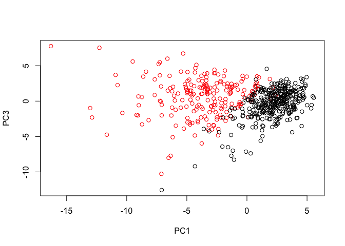
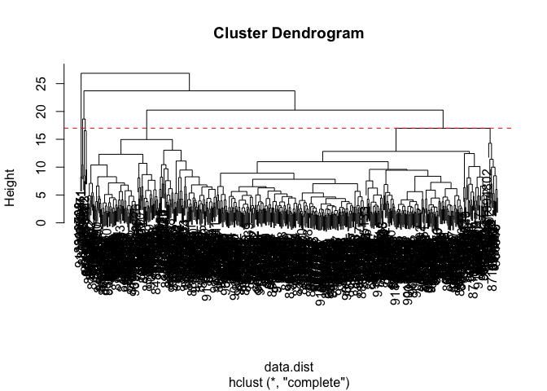

Class09
================
Hanqing Zhao
10/29/2019

# Prepare the data

``` r
fna.data <- "/Users/zhq/BIMM143/WisconsinCancer.csv"
wisc.df <- read.csv(fna.data)
# Convert the features of the data: wisc.data
wisc.data <- as.matrix(wisc.df[3:32])
# Set the row names of wisc.data
row.names(wisc.data) <- wisc.df$id
#head(wisc.data)
# Create diagnosis vector for later 
diagnosis <-wisc.df$diagnosis
#diagnosis
```

How many observations in the data? 569

``` r
dim(wisc.data)
```

    ## [1] 569  30

How many of the observations have a malignant diagnosis?

``` r
m<-sum(as.numeric(wisc.df$diagnosis=="M"))
m
```

    ## [1] 212

## Perform PCA

``` r
# Check column means and standard deviations
colMeans(wisc.data)
```

    ##             radius_mean            texture_mean          perimeter_mean 
    ##            1.412729e+01            1.928965e+01            9.196903e+01 
    ##               area_mean         smoothness_mean        compactness_mean 
    ##            6.548891e+02            9.636028e-02            1.043410e-01 
    ##          concavity_mean     concave.points_mean           symmetry_mean 
    ##            8.879932e-02            4.891915e-02            1.811619e-01 
    ##  fractal_dimension_mean               radius_se              texture_se 
    ##            6.279761e-02            4.051721e-01            1.216853e+00 
    ##            perimeter_se                 area_se           smoothness_se 
    ##            2.866059e+00            4.033708e+01            7.040979e-03 
    ##          compactness_se            concavity_se       concave.points_se 
    ##            2.547814e-02            3.189372e-02            1.179614e-02 
    ##             symmetry_se    fractal_dimension_se            radius_worst 
    ##            2.054230e-02            3.794904e-03            1.626919e+01 
    ##           texture_worst         perimeter_worst              area_worst 
    ##            2.567722e+01            1.072612e+02            8.805831e+02 
    ##        smoothness_worst       compactness_worst         concavity_worst 
    ##            1.323686e-01            2.542650e-01            2.721885e-01 
    ##    concave.points_worst          symmetry_worst fractal_dimension_worst 
    ##            1.146062e-01            2.900756e-01            8.394582e-02

``` r
apply(wisc.data,2,sd)
```

    ##             radius_mean            texture_mean          perimeter_mean 
    ##            3.524049e+00            4.301036e+00            2.429898e+01 
    ##               area_mean         smoothness_mean        compactness_mean 
    ##            3.519141e+02            1.406413e-02            5.281276e-02 
    ##          concavity_mean     concave.points_mean           symmetry_mean 
    ##            7.971981e-02            3.880284e-02            2.741428e-02 
    ##  fractal_dimension_mean               radius_se              texture_se 
    ##            7.060363e-03            2.773127e-01            5.516484e-01 
    ##            perimeter_se                 area_se           smoothness_se 
    ##            2.021855e+00            4.549101e+01            3.002518e-03 
    ##          compactness_se            concavity_se       concave.points_se 
    ##            1.790818e-02            3.018606e-02            6.170285e-03 
    ##             symmetry_se    fractal_dimension_se            radius_worst 
    ##            8.266372e-03            2.646071e-03            4.833242e+00 
    ##           texture_worst         perimeter_worst              area_worst 
    ##            6.146258e+00            3.360254e+01            5.693570e+02 
    ##        smoothness_worst       compactness_worst         concavity_worst 
    ##            2.283243e-02            1.573365e-01            2.086243e-01 
    ##    concave.points_worst          symmetry_worst fractal_dimension_worst 
    ##            6.573234e-02            6.186747e-02            1.806127e-02

``` r
# Perform PCA on wisc.data by completing the following code
wisc.pr <- prcomp(wisc.data, scale = T)
# Look at summary of results
summary(wisc.pr)
```

    ## Importance of components:
    ##                           PC1    PC2     PC3     PC4     PC5     PC6
    ## Standard deviation     3.6444 2.3857 1.67867 1.40735 1.28403 1.09880
    ## Proportion of Variance 0.4427 0.1897 0.09393 0.06602 0.05496 0.04025
    ## Cumulative Proportion  0.4427 0.6324 0.72636 0.79239 0.84734 0.88759
    ##                            PC7     PC8    PC9    PC10   PC11    PC12
    ## Standard deviation     0.82172 0.69037 0.6457 0.59219 0.5421 0.51104
    ## Proportion of Variance 0.02251 0.01589 0.0139 0.01169 0.0098 0.00871
    ## Cumulative Proportion  0.91010 0.92598 0.9399 0.95157 0.9614 0.97007
    ##                           PC13    PC14    PC15    PC16    PC17    PC18
    ## Standard deviation     0.49128 0.39624 0.30681 0.28260 0.24372 0.22939
    ## Proportion of Variance 0.00805 0.00523 0.00314 0.00266 0.00198 0.00175
    ## Cumulative Proportion  0.97812 0.98335 0.98649 0.98915 0.99113 0.99288
    ##                           PC19    PC20   PC21    PC22    PC23   PC24
    ## Standard deviation     0.22244 0.17652 0.1731 0.16565 0.15602 0.1344
    ## Proportion of Variance 0.00165 0.00104 0.0010 0.00091 0.00081 0.0006
    ## Cumulative Proportion  0.99453 0.99557 0.9966 0.99749 0.99830 0.9989
    ##                           PC25    PC26    PC27    PC28    PC29    PC30
    ## Standard deviation     0.12442 0.09043 0.08307 0.03987 0.02736 0.01153
    ## Proportion of Variance 0.00052 0.00027 0.00023 0.00005 0.00002 0.00000
    ## Cumulative Proportion  0.99942 0.99969 0.99992 0.99997 1.00000 1.00000

``` r
biplot(wisc.pr)
```

<!-- -->

``` r
# Scatter plot observations by components 1 and 2
plot( wisc.pr$x, col = c(diagnosis) , 
     xlab = "PC1", ylab = "PC2")
```

<!-- --> Generate pca
plot for PC1 and PC3

``` r
# Repeat for components 1 and 3
plot(wisc.pr$x[,1:3], col = diagnosis, 
     xlab = "PC1", ylab = "PC3")
```

<!-- -->

# Hiearchical clustering

``` r
# Scale the wisc.data data: data.scaled
data.scaled <- scale(wisc.data)
data.dist <- dist(data.scaled)
wisc.hclust <- hclust(data.dist, method = "complete")
plot(wisc.hclust)
abline(h = 17, col="red", lty=2)
```

<!-- -->

wisc.hclust.clusters \<- cutree(wisc.hclust, k = 4)
table(wisc.hclust.clusters, diagnosis) grps \<- cutree(wisc.pr.hclust)

wisc.km \<- kmeans(, centers= , nstart= )

# 3D

library(rgl) plot3d(wisc.pr$x\[,1:3\], xlab=“PC 1”, ylab=“PC 2”,
zlab=“PC 3”, cex=1.5, size=1, type=“s”, col=grps)

# Prediction

\#url \<- “new\_samples.csv” url \<-
“<https://tinyurl.com/new-samples-CSV>” new \<- read.csv(url) npc \<-
predict(wisc.pr, newdata=new) npc

plot(wisc.pr$x\[,1:2\], col=g) points(npc\[,1\], npc\[,2\], col=“blue”,
pch=16, cex=3) text(npc\[,1\], npc\[,2\], c(1,2), col=“white”)
